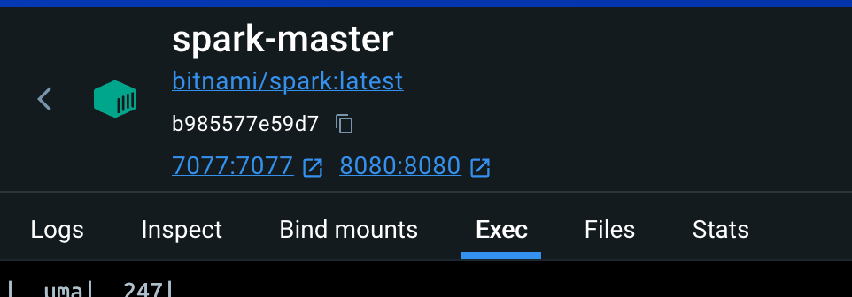

# Project overview
This project is designed to run on containers using Docker that can be expanded for Kubernetes usage in the future.
# Getting Started
All you need to run your cluster is having Docker installed and follow Steps on terminal/shell.
# Step-by-Step
### 0. Open Docker
### 1. Enter on you terminal
### 2. Go to project root folder
### 3. Run `docker-compose up`
### 4. Go to Containers in Docker

### 5. Select Master node 
### 6. Go to `Exec` tab

### 7. At this point you can edit your `task.py` code to choose what you want to submit to cluster process
### 8. Run `/opt/bitnami/spark/bin/spark-submit /opt/spark-app/script.py`
 Now you should see output on Exec tab from docker.